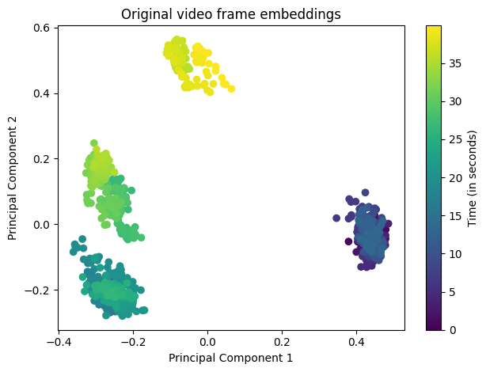
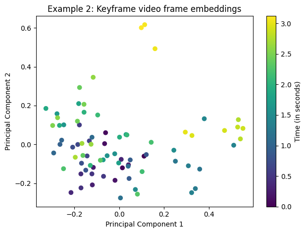
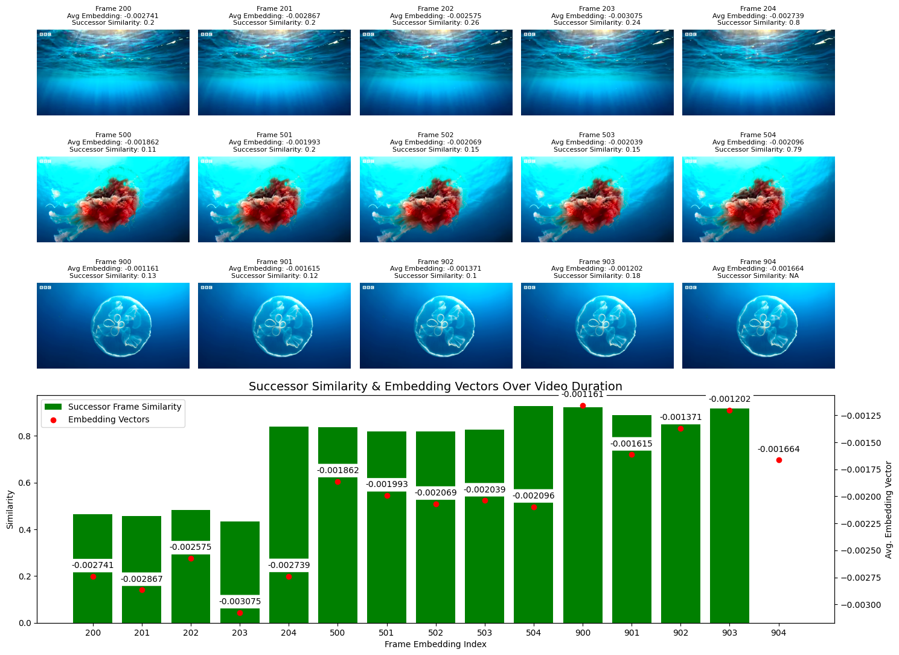
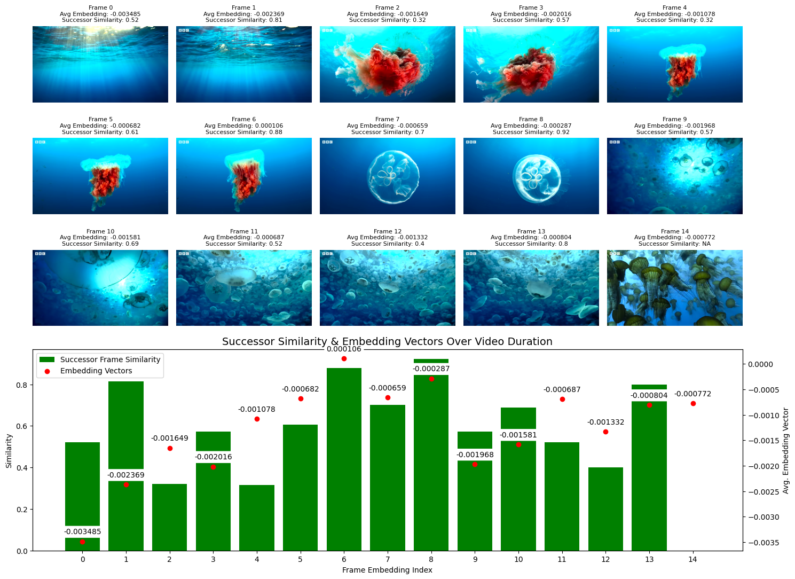

# Project Description
This project introduces an efficient approach to video segmentation aimed at summarizing videos into highly representative keyframes. The core technique involves analyzing semantic embeddings extracted from video frame embedding pairs. Each frame is assigned a score calculated based on the Euclidean distance between the embedding of the current frame and its successor. A significant distance implies dissimilarity between frames as a marker for a potential transition or "seam" between segments. These seams are identified when the successor score surpasses a dynamically adjusted threshold or is set according to a predetermined value. 
##

  <table style="margin: 0 auto;">
    <tr>
      <td colspan="2" style="text-align: center;">
        <a href="https://www.youtube.com/watch?v=nXBoOam5xJs">The Deadly Portuguese Man O' War | 4KUHD | Blue Planet II | BBC Earth</a>
      </td>
    </tr>
    <tr>
      <td style="text-align: center;">
        
      </td>
      <td style="text-align: center;">
        
      </td>
    </tr>
    <tr>
      <td rowspan="2" style="text-align: center;">
         
        
      </td>
      <td style="text-align: center;">
        
      </td>
    </tr>
  </table>

## Summary Review of Process

1. **Download YouTube Video and Extract Keyframes Using video2dataset**
    - `video2dataset` employs `yt-dl` for video downloading and `ffmpeg` for keyframe extraction.
    - This step yields: original videos, keyframes, and the YouTube metadata JSON.

2. **Convert Original Frames and Keyframes to Numpy Array**
    - The original frames and keyframes are processed via `clip-video-encode` to generate their embedding vectors.
    - These vectors are created using a pretrained `laion2b_s34b_b79k ViT-B-32` model.
    - The embeddings act as a compact representation of the frames and keyframes, encapsulating essential visual features.

3. **Analysis, Visualization, and Fine-tuning**
    - A sliding window method and k-NN are utilized to identify segments where the successor value either crosses a specific threshold or shows a unique pattern.
    - After determining optimal values, the script is configured and run to produce image and video keyframes.
    - The primary output consists of 2-15 second clips, each containing 2-4 keyframes that are most representative of the clip's content.

Key Terms

  - **Distance Metrics**: Uses Euclidean distance to measure the similarity between embeddings of adjacent frames.
  - **Successor Values**: The euclidean distance of the current frame to its successor frame - used to qualify new segments.

## Key features:
1. **Dynamic Thresholds**: Adapts to varying video content using a rolling average and standard deviation to adjust the threshold.
2. **Embedding Semantics**: Using semantic embeddings allows for a rich representation of content, enabling the system to identify better segments where a significant change occurs.
3. **Successor Score**: The primary heuristic in keyframe detection through the Euclidean distance between successive frame embeddings.
4. **Embedding Surveyor**: Leverages K-Nearest Neighbors (KNN) to fine-tune the dynamic thresholds, providing a second layer of adaptability and increasing segmentation accuracy.
5. **Seam Detection**: Leveraging the successor score and KNN for detecting "trending" seams presents a novel way of identifying key moments without needing explicit object recognition or manual labeling.
6. **Adaptive System**: The combination of dynamic thresholds and successor scores allows the system to adapt to different videos and changes within a single video.

## File Structure and Description
- Sample data (`dataset/`):
- Examples and walk throughs (`notebooks/`)
- Expected outputs from `scripts/` (`plots/`)
- Processing or maintainance scripts (`processing/`)
- Source code, scripts containing main project code (`scripts/`)

## Methods & Examples (`notebooks/`)
- Sample data for testing (`notebooks/`):
    - Process demonstration and performance evaluations:
        - `EDA.ipynb`
        - `Example1.ipynb`
        - `Example2.ipynb`
        - `Results EDA.ipynb`
    - Examples to test locally or with a cloud notebook:
      - `video_encode_pipeline.ipynb`
### Relevant Tools and Libraries
- [clip-video-encode](https://github.com/iejMac/clip-video-encode/blob/main/clip_video_encode/clip_video_encode.py)
- [video2dataset](https://github.com/iejMac/video2dataset/blob/main/requirements.txt)

## References
- Su, J., Yin, R., Zhang, S., & Luo, J. (2023). Motion-state Alignment for Video Semantic Segmentation.
- Cho, S., Kim, W. J., Cho, M., Lee, S., Lee, M., Park, C., & Lee, S. (2022). Pixel-Level Equalized Matching for Video Object Segmentation
- Han, Z., He, X., Tang, M., & Lv, Y. (2021). Video Similarity and Alignment Learning on Partial Video Copy Detection
- Cho, D., Hong, S., Kang, S., & Kim, J. (2019). Key Instance Selection for Unsupervised Video Object Segmentation